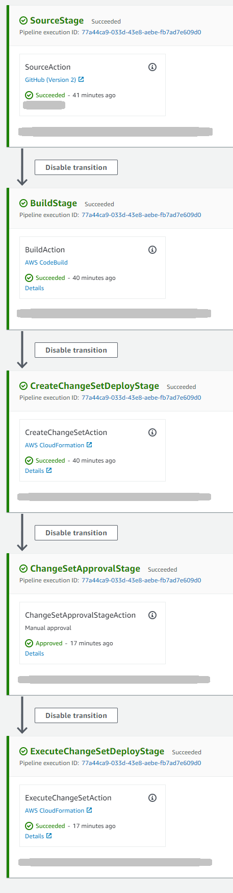
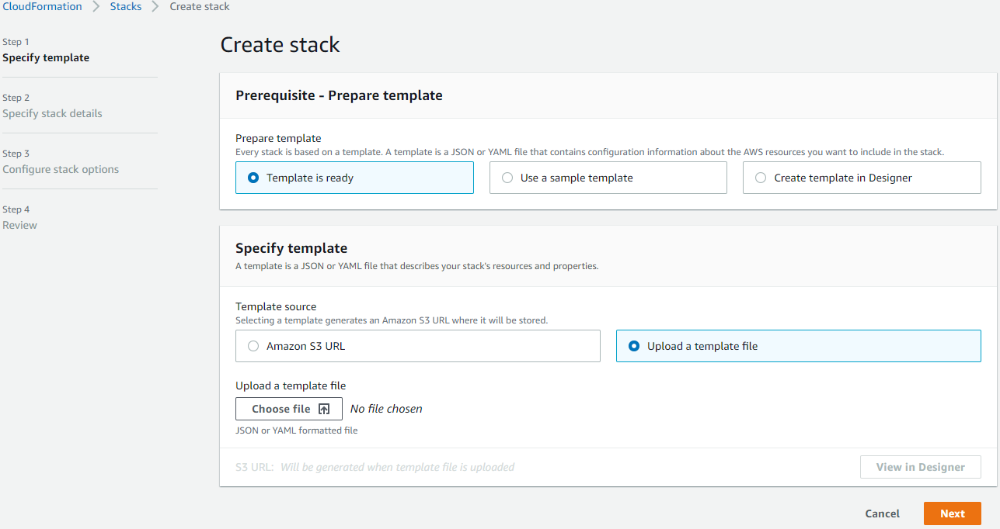
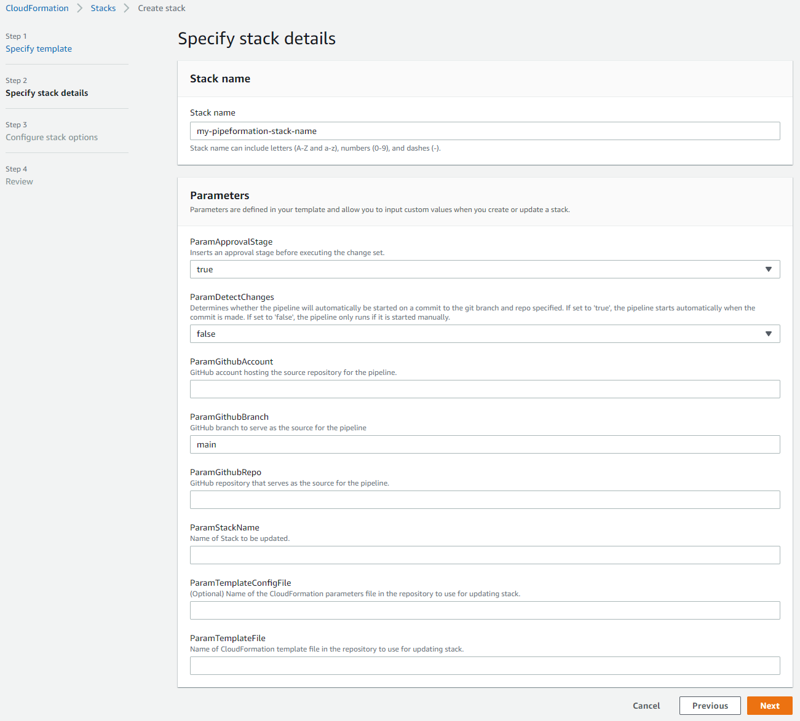
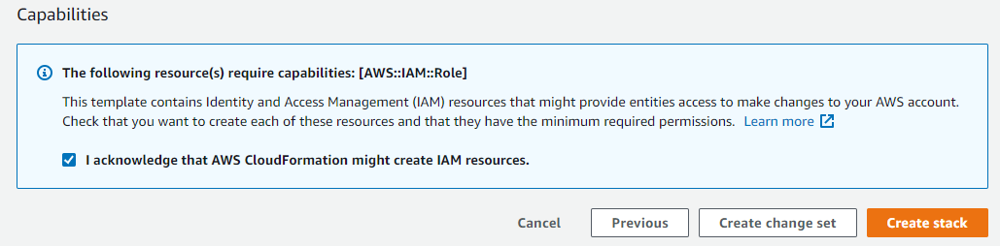

# pipeformation

This creates a deployment pipeline using AWS CodePipeline, along with associated AWS infrastructure, for automatically deploying updates to an existing CloudFormation stack based on changes to a source CloudFormation template. The source template must be stored in a github repository and the destination stack must be in the same AWS account as the pipeline. The pipeline is itself created using a CloudFormation template, which is deployed manually and referred to as the pipeformation Cloudformation template.



## Security Warning

**THE CLOUDFORMATION SERVICE WILL NEED TO ASSUME A ROLE THAT WILL NECCESARILY NEED BROAD AND WIDE-RANGING PERMISSIONS TO MANAGE THE STACK RESOURCES. EFFECTIVELY ANY PERSON THAT CAN CHECK CODE IN TO THE SOURCE BRANCH IN THE WILL HAVE THOSE PERMISSIONS TO MAKE EXTENSIVE AND DESTRUCTIVE CHANGES TO THE ACCOUNT. ENSURE THAT YOU TRUST THE GITHUB REPOSITORY AND TAKE STEPS TO PROTECT THE SOURCE BRANCH. REVIEW THE IAM ROLES IN THE PIPEFORMATION TEMPLATE AND MAKE THE APPROPRIATE CHANGES TO SECURE YOUR ENVIRONMENT. ENSURE THAT AN APPROVAL STAGE IS USED FOR ANY PRODUCTION DEPLOYMENT SO CHANGES CAN BE REVIEWED. USE AT YOUR OWN RISK. ALTHOUGH THIS APPLICATION IS DESIGNED TO BE LOW-COST, AWS CHARGES WILL BE INCURRED, WHICH YOU (OR THE BILL-PAYER) WILL BE RESPONSIBLE FOR. USE AT YOUR OWN RISK. PLEASE SEE THE ADDITIONAL WARRENTY DISCLAIMER IN THE LICENSE FILE.**  

## Features

- Can run automatically with each commit or manual release only.
- Optional build stage that runs the ```aws cloudformation package``` command. This
  will packaging local artifacts that the CloudFormation template references.
  This is required where the template includes a Transform section, for example, where serverless resources are included.
- Creating and executing a change set are separate stages, to allow the changes to be reviewed and approved prior to deployment.
- Optional approval stage prior to executing a CloudFormation change set.

## Prequisites

- AWS account with appropriate rights.
- GitHub account, repository and branch.
- Existing stack to received updates. If this is to build and update a new stack, there is a simple CloudFormation template ```empty.template.yaml``` provided that will create no AWS resources, but simply creates a stack that can serve as a target.

## Deployment

1. Clone or download the repo to your local computer.

2. From the CloudFormation console at https://console.aws.amazon.com/cloudformation/home, create a new stack. This stack is the pipeformation stack that is created manually.

3. Review the pipeformation template ```pipeformation.template.yaml``` and edit as required. In particular, review the IAM role ```IAMRoleCloudformation```. This is the role assumed by the CloudFormation service for creating / updating / deleting AWS resources. The pipeformation template provided has some example permissions. The permissions required will depend upon the resources that are required to deploy your source template, which will vary according to the resources used in the source template. They will require modification before use.

4. At the **Specify Template** page, select **Upload a template file.** Select the file ```pipeformation.template.yaml```

5. At the **Specify Stack Details** page, provide the stack name and the various parameters required.

6. All of the defaults on the **Configure stack options** can be accepted.

7. On the **Review** page, at the **Capabilities** section, check the box to allow IAM resources to be created.

8. Monitor the stack creation process. After a few minutes it should change to the status of: ```UPDATE_COMPLETE```.

9. Check the CodePipeline console at: https://console.aws.amazon.com/codesuite/codepipeline/pipelines/home to confirm the pipeline has been correctly deployed.






